# Medaudit 2.0 - Medical Device Security Audit Platform

A comprehensive security auditing tool for HL7 v2.x medical device communications. Built for penetration testers, security auditors, and researchers working with healthcare systems.

Medaudit provides PCAP traffic analysis, PII detection, an interactive HL7 client with malformed payload library, protocol fuzzing, a managed HL7 server, HTTP-to-HL7 proxying, a Burp Suite extension, and an AI-powered pentest co-pilot -- all through a unified web interface.

---

---

## Screenshots

| Projects Dashboard | New Project |
|:---:|:---:|
| 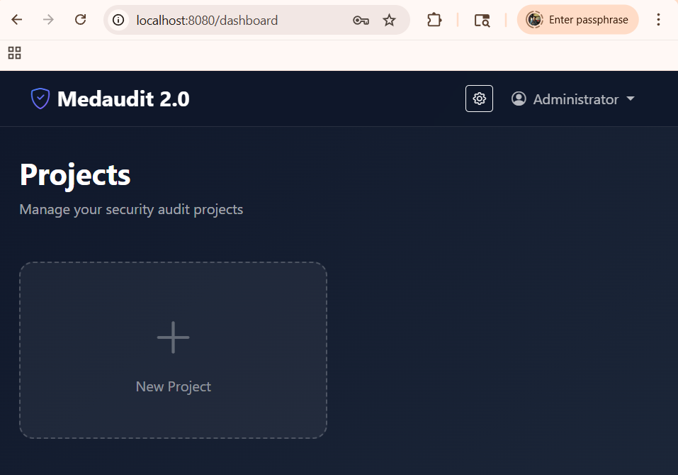 | 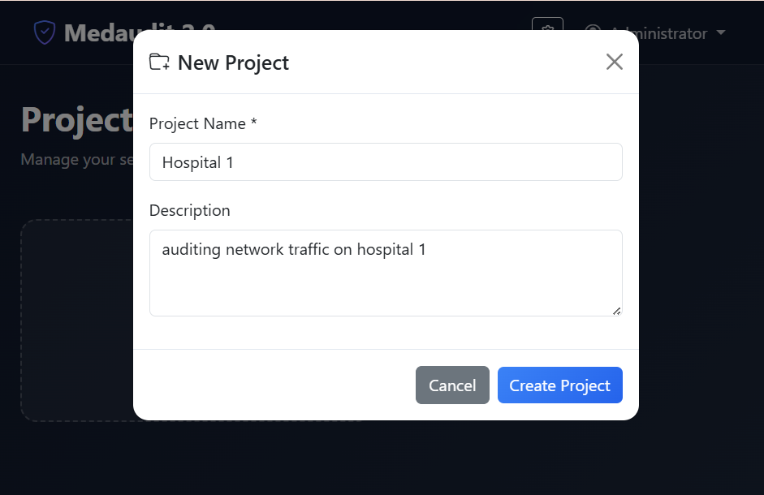 |

| Manual HL7 Client | Malformed Payloads |
|:---:|:---:|
| 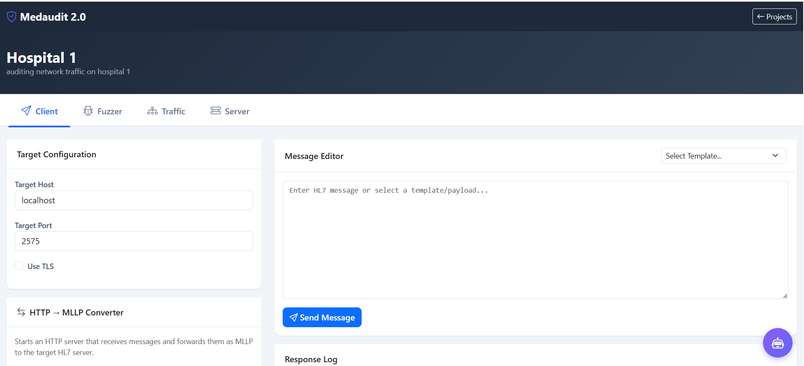 | 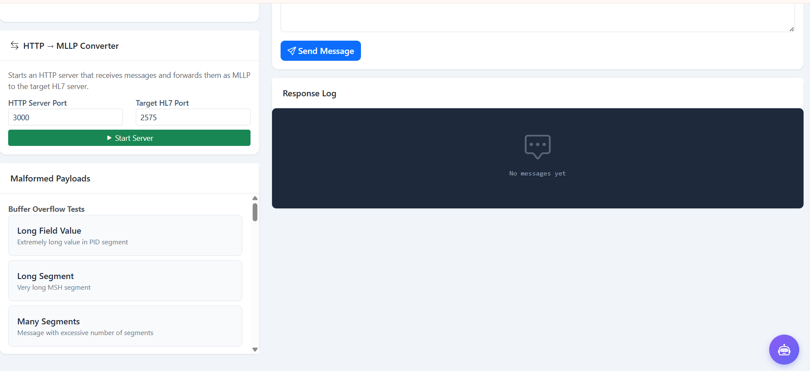 |

| HL7 Device Fuzzer | Fuzzing History |
|:---:|:---:|
| 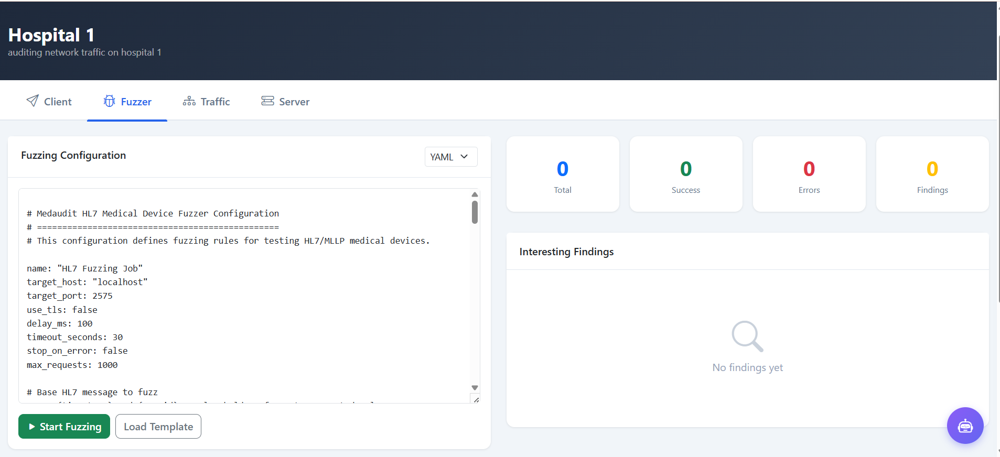 | 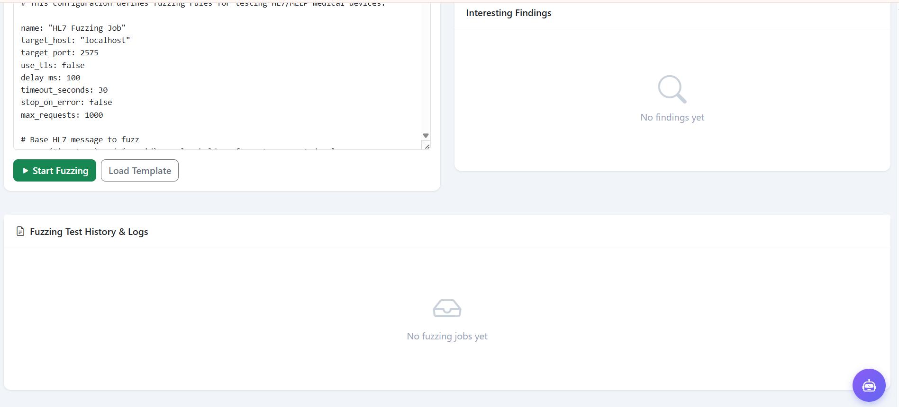 |

| Traffic Analysis | PII Detection |
|:---:|:---:|
| 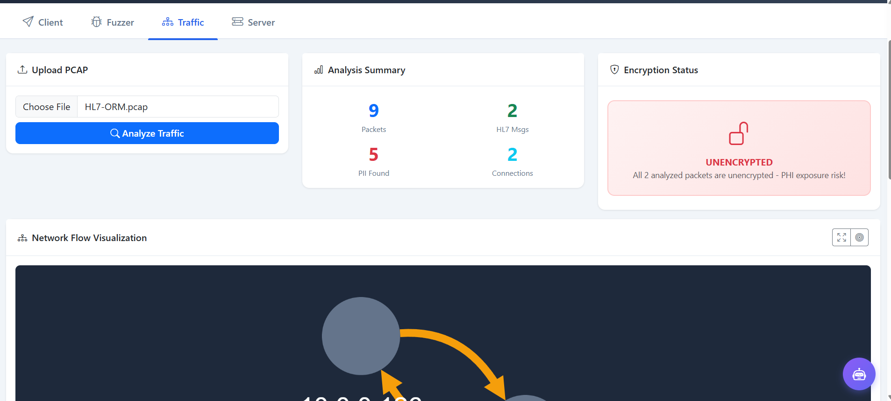 | 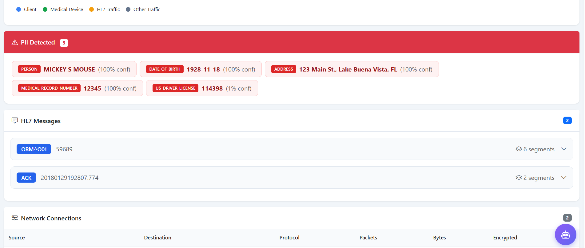 |

| Network Flow | HL7 Server Manager |
|:---:|:---:|
| 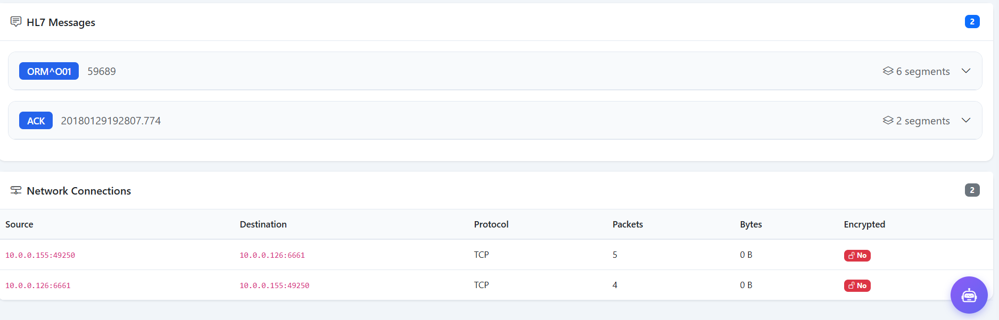 | 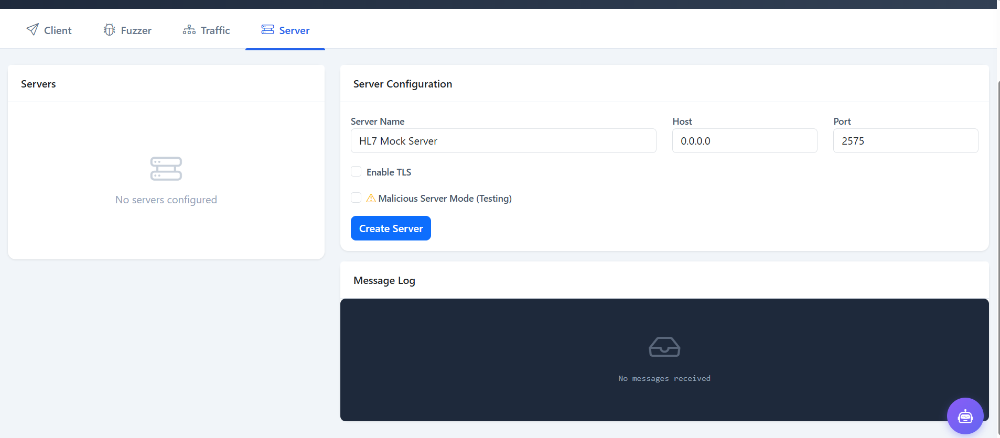 |

| AI Assistant Sidebar | AI Settings |
|:---:|:---:|:---:|
| 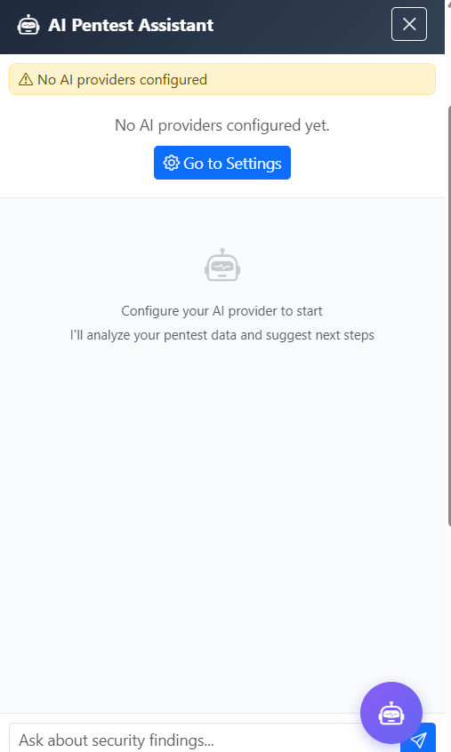 | 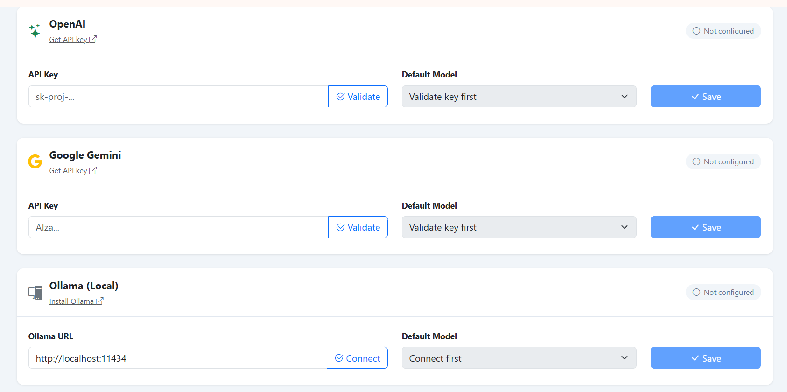 |

---

## Quick Start

### Prerequisites
- The **Spacy model for PII detection** is required (~500MB). It will be automatically downloaded when installing `requirements.txt`.

```bash
# Clone and install
git clone https://github.com/anirudhduggal/medaudit2.git
cd medaudit2
python3 -m venv venv
source venv/bin/activate  # Windows: venv\Scripts\activate
pip install -r requirements.txt

# Start the web UI
python -m medaudit web --generate-password
```

Open `http://localhost:8080` and log in with the credentials shown in the terminal.

---

## Features

### Web UI Platform

The primary interface for security auditing. Start with `python -m medaudit web` and access all features through the browser.

**Authentication & Projects**
- Single local admin account with CLI-configurable password (`--password` or `--generate-password`)
- PBKDF2-SHA256 password hashing, rate-limited login (5 attempts / 5 min), session management
- Project-based workspace organization for managing multiple engagements
- Security headers (CSP, X-Frame-Options, etc.) on all responses

**Client Tab -- Manual Testing**
- Interactive HL7 client for sending messages to medical devices
- Built-in malformed payload library: buffer overflow, SQL injection, XXE, command injection, format strings, delimiter manipulation
- **Send Mode selector**: send payloads as a client (to a server) or start a malicious server (to send crafted responses to connecting clients)
- HL7 Listener (Proxy) for receiving messages from medical devices
- Full request/response logging

**Fuzzer Tab -- Automated Testing**
- YAML/JSON fuzzing rule configuration
- Strategies: field mutation (overflow, special chars, SQL, cmd injection, unicode, boundary), segment injection/removal/reorder, delimiter manipulation
- Real-time progress, start/stop controls, finding detection
- Automatically uses target configured in the Client tab

**Traffic Tab -- PCAP Analysis**
- Upload and analyze PCAP files with HL7 traffic
- HL7 message parsing with segment-level field detail
- PII detection (Presidio NLP + regex): names, patient IDs, SSNs, credit cards, phone numbers, addresses
- Encryption status assessment
- Network flow visualization (Cytoscape.js graph + sequence diagrams)
- Connection table with protocol and encryption breakdown

**Server Tab -- Managed HL7 Servers**
- Create multiple HL7 server instances with configurable ports
- TLS support with certificate path validation
- Real-time message logging (connections, received messages, sent ACKs, errors)
- Start/stop with clean port release

**AI Pentest Assistant (Sidebar)**
- Persistent, resizable sidebar accessible across all tabs
- AI-powered analysis with full project context awareness (server logs, client history, fuzzer findings, PCAP results, and auto-pentest results)
- Actionable suggestions with executable "Run this" buttons
- Auto-analysis of events with batched processing
- Token usage and cost tracking
- Quick prompts: Status overview, Vulnerability analysis, Next steps

**Auto-Pentest Agent (semi-autonomous)**
- One-click engagement that runs a full HL7 methodology: recon → fuzzing → SQLi & DoS oracles → PHI/PII scan → **gated** stored-XSS exploit → report
- Shows the agent's **reasoning before each stage**, with deliberate pacing and live fuzz progress
- **Robust failure handling**: every check reports finding / clean / skipped (not-tested) / error, with a coverage summary — it never silently claims "clean" when it couldn't test
- The offensive exploit step **pauses for explicit operator approval** (and non-loopback targets require confirmation — see the blast-radius guard below)
- **Intensity levels** (Light / Standard / Thorough) and optional AI-narrated approach
- Findings are written with accurate, agent-documented detail (description, reproduction steps, payload, impact, remediation)

**Findings & Reporting**
- **Findings tab** consolidating auto-pentest and fuzzer findings, ranked by severity and expandable to full detail
- Export findings to **CSV**, or generate a **PDF pentest report** (executive summary + detailed findings)

### AI Provider Support

Configure AI providers globally in **Settings** (gear icon on dashboard). All configured providers are available in every project's sidebar. You can configure multiple providers and switch between them freely within any project.

| Provider | Models | Setup |
|----------|--------|-------|
| **Anthropic Claude** | Claude Sonnet 4, Claude 3.5 Sonnet/Haiku, Claude 3 Opus | API key from [console.anthropic.com](https://console.anthropic.com/settings/keys) |
| **OpenAI** | GPT-4o, GPT-4o Mini, GPT-4 Turbo, o1, o3-mini | API key from [platform.openai.com](https://platform.openai.com/api-keys) |
| **OpenRouter** | Any model on OpenRouter (Claude, GPT, Gemini, Llama, Mistral, ...) | API key from [openrouter.ai/keys](https://openrouter.ai/keys) |
| **Google Gemini** | Gemini 2.5 Flash/Pro, Gemini 2.0 Flash, Gemini 1.5 Pro/Flash | API key from [aistudio.google.com](https://aistudio.google.com/apikey) |
| **Ollama (Local)** | Any locally installed model | [ollama.com](https://ollama.com) -- no API key needed |

Provider keys you configure in **Settings** are persisted to the SQLite database and auto-loaded on startup, so you configure once and they survive restarts. They are **encrypted at rest** with a local data-encryption key (`medaudit/data/.secret_key`, created with `0600` permissions) that is independent of your admin password, so rotating the password never orphans saved keys. The **Disconnect** button wipes keys from both memory and disk. The database file on its own (e.g. in a backup or if committed to git) cannot decrypt the keys without the adjacent keyfile — but note this is *not* protection against an attacker who can read your whole data directory.

### Burp Suite Extension

A Java extension for Burp Suite that forwards requests to the Medaudit HTTP-to-MLLP proxy for HL7 security testing. Source code is provided under [`burp-extension/`](burp-extension/).

1. Build the extension JAR from source:
   ```bash
   cd burp-extension
   gradle jar
   # Output: build/libs/medaudit2-burp-extension-1.0.0.jar
   ```
2. In Burp Suite: **Extensions > Add > Java** and select `build/libs/medaudit2-burp-extension-1.0.0.jar`
3. Configure the Medaudit proxy host/port in the **Medaudit2** tab
4. Right-click any request in Proxy/Repeater and select **"Send to Medaudit2"**
5. Responses appear in the **Medaudit2 > Response Log** tab

See [`burp-extension/README.md`](burp-extension/README.md) for full details.

### Docker

```bash
# Pull and run
docker pull anirudhduggal/medaudit:latest
docker run -p 8080:8080 anirudhduggal/medaudit

# With persistent data
docker run -p 8080:8080 -v medaudit-data:/app/medaudit/data anirudhduggal/medaudit

# With custom password
docker run -p 8080:8080 anirudhduggal/medaudit --password "MySecurePassword"
```

### CLI Tools

In addition to the web UI, Medaudit provides standalone CLI commands:

```bash
# Analyze a PCAP file
python -m medaudit analyze path/to/capture.pcap

# Start HL7 mock server
python -m medaudit.hl7server start --port 2575

# Start HTTP-to-HL7 proxy (for Burp Suite / ZAP integration)
python -m medaudit proxy --port 8080 --hl7-host localhost --hl7-port 2575

# Show/create configuration
python -m medaudit config --show
python -m medaudit config --create

# Manage users
python -m medaudit user --create --username john --password pass123 --admin

# Run HL7 fuzzer
python -m medaudit.fuzzer run -c config.yaml -o results.json
```


## Command Reference

| Command | Description | Example |
|---------|-------------|---------|
| `web` | Start web UI | `python -m medaudit web --generate-password --port 8080` |
| `analyze` | Analyze PCAP file | `python -m medaudit analyze capture.pcap` |
| `proxy` | HTTP-to-HL7 proxy | `python -m medaudit proxy --port 8080 --hl7-port 2575` |
| `config` | Manage configuration | `python -m medaudit config --show` |
| `user` | Create local users | `python -m medaudit user --create --username john --password pass123` |
| `hl7server start` | Start HL7 server | `python -m medaudit.hl7server start --port 2575` |
| `fuzzer run` | Run automated fuzzing | `python -m medaudit.fuzzer run -c config.yaml` |
| `fuzzer test` | Test connection to server | `python -m medaudit.fuzzer test --host localhost --port 2575` |
| `fuzzer server` | Start malicious server | `python -m medaudit.fuzzer server --mode no_ack` |
| `fuzzer attacks`| List fuzzer attack modes | `python -m medaudit.fuzzer attacks` |
| `mcp` | Start Model Context Protocol server | `python -m medaudit mcp` |

### Web Server Options

```bash
python -m medaudit web [OPTIONS]

Options:
  --host TEXT          Host to bind (default: 0.0.0.0)
  --port INT           Port to listen on (default: 8080)
  --password TEXT      Set a custom admin password
  --generate-password  Generate a random secure password
```

---

## Configuration

Configuration files are auto-loaded from `medaudit/config/medaudit.json`:

```json
{
  "proxy": {
    "http_host": "0.0.0.0",
    "http_port": 8080,
    "hl7_host": "localhost",
    "hl7_port": 2575
  },
  "analysis": {
    "max_hl7_messages": 10,
    "max_pii_instances": 20
  },
  "logging": {
    "enabled": true,
    "log_dir": "logs"
  }
}
```

### Data Storage

All runtime data is stored inside the `medaudit/` package:
- **Database**: `medaudit/data/medaudit.db` (SQLite)
- **Project artifacts**: `medaudit/data/artifacts/projects/<project_id>/pcaps/`
- **Logs**: `medaudit/logs/YYYY-MM-DD/`
- **Configuration**: `medaudit/config/`

---

## Testing

```bash
# Run all tests
pytest tests/ -v

# Specific test file
pytest tests/test_pii_check.py -v

# With coverage
pytest tests/ --cov=medaudit --cov-report=html
```

---

## Security

Medaudit implements the following security measures:

- **Password hashing**: PBKDF2-SHA256 with 600,000 iterations and constant-time comparison
- **No default password**: Generates a random 20-character password if none is specified
- **Rate limiting**: 5 login attempts per 5 minutes, 15-minute lockout
- **Session management**: httpOnly cookies, 24-hour expiry, server-side revocation on logout
- **Security headers**: X-Content-Type-Options, X-Frame-Options, CSP, Permissions-Policy
- **Fuzzer blast-radius guard**: fuzzing a non-loopback target requires explicit operator confirmation (`confirm_target` in the API / `--i-am-authorized` on the CLI); campaign volume is capped and remote targets get a minimum inter-message delay so a config can't accidentally flood a live device. Override the limits for authorized lab work with `MEDAUDIT_FUZZ_MAX_REQUESTS` and `MEDAUDIT_FUZZ_MIN_DELAY_MS`.
- **Path traversal protection**: TLS certificate paths validated against allowlist
- **API key safety**: Ad-hoc keys stay in memory; project-saved keys are encrypted at rest (Fernet/AES) with a `0600` sidecar key independent of the login password
- **Admin password**: Set on first run (random if unspecified) and preserved across restarts; rotate explicitly with `--password` or `--generate-password`

---

## Troubleshooting

**Spacy model not found:**
```bash
python -m spacy download en_core_web_lg --upgrade
```

**Port already in use:**
```bash
lsof -i :8080
kill -9 <PID>
```

**Database schema mismatch after update:**
```bash
rm medaudit/data/medaudit.db
# Restart the server -- database will be recreated
```

**Import errors:**
```bash
source venv/bin/activate
pip install --force-reinstall -r requirements.txt
```

---

## Contributing

We welcome contributions! Please:
1. Fork the repository
2. Create a feature branch (`git checkout -b feature/my-feature`)
3. Follow existing code patterns and PEP 8 style
4. Add tests for new functionality
5. Submit a pull request

---

## AI Assistants & Agents

If you are an AI assistant, coding agent, or LLM working on this codebase, **STOP** and read the project instructions located in the `agents/` folder before proceeding. Depending on your model and environment, please review the corresponding rules file (e.g., `agents/geminirules.md`, `agents/cursorrules.md`, `agents/CLAUDE.md`, etc.) to understand the architectural guidelines, testing requirements, and best practices governing this repository.

---

## Disclaimer

**Medaudit 2.0 is intended for authorized security testing and research purposes only.**

- Use only on systems you have explicit permission to test
- The authors are not responsible for any misuse or damage caused by this tool
- Always comply with applicable laws, regulations, and organizational policies

---

## Support

- **Issues**: [GitHub Issues](https://github.com/anirudhduggal/medaudit2/issues)
- **Discussions**: [GitHub Discussions](https://github.com/anirudhduggal/medaudit2/discussions)
